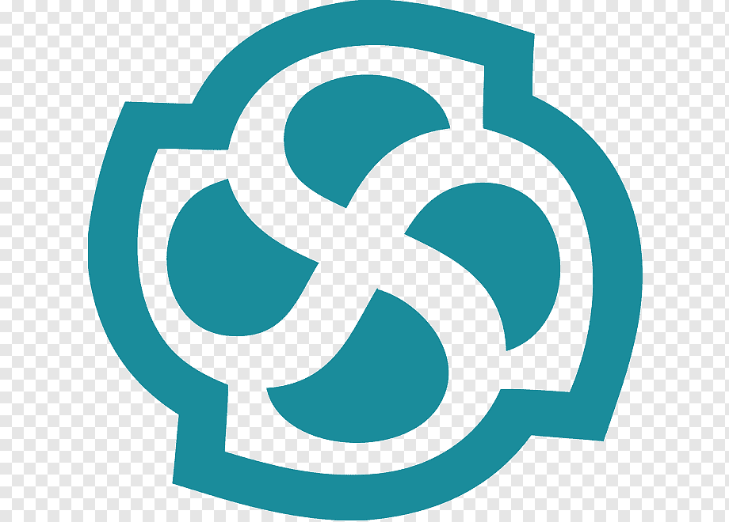

# Hi there, I'm Pham Hai Dang 👋
I was born and raised in Vietnam. I am currently a Junior at VNUHCM-University Of Science. My daily task is to study and learn new things.

## My skills 💪
These are some of the major technologies that I use or have worked on in the past:

**Programming languages**

|||||
|--|--|--|--|--|--|

**Database Management Systems**

|
|--|--|

**IDEs**

|
|--|--|

**UML Design Tools**

|
|--|
